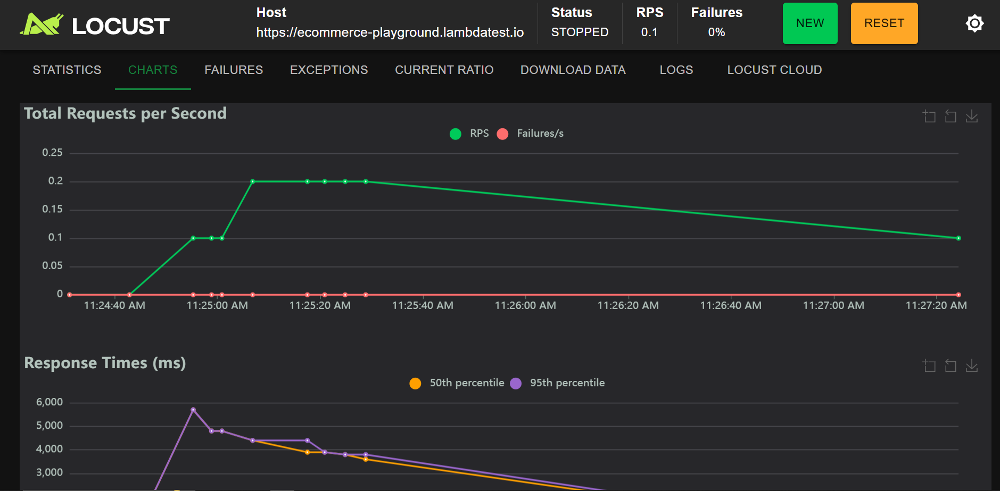

# Locust Load Testing Demo

Locust is an open-source Python tool for load-testing applications at scale. This repository is a simple demo of how to perform load testing with the Locust library.

## Project structure

```
api_example
├──screenshots
├──selenium_setup
   └──setup.py
├──local_locustfile.py
├──locustfile.py
├──locust_with_selenium.py
├──main.py
├──requirements.txt
└──.gitignore
```

### To run the test:

#### Install the requirements:

```
pip3 install -r requirements.txt
```

#### Run the locust file:

To run the default load test from a `locustfile.py`:

```
locust
```

If the script isn't in a `locustfile.py`, you can also specify the file containing the test.
For instance, to run the local load test:

Start the Fast API server:

```
uvicorn main:app --reload
```

Run the load test from the `local-locustfile.py` file:

```
locust -f local_locustfile.py
```

Execute the load test by automating Selenium with Locust

```
locust -f locust_with_selenium.py
```

## Execution Results

### 1. Locust UI

## 

## 

## 

## 

### 2. Cloud Grid Execution


